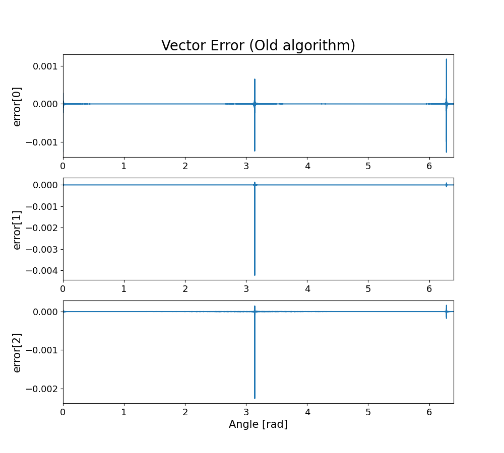
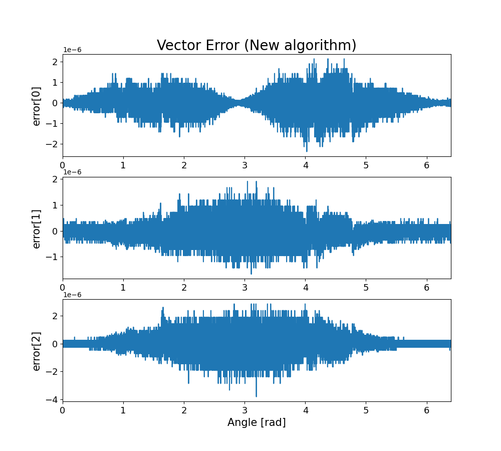

# Versor求解アルゴリズムの精度比較

宇宙電波実験室の記事内で使用したプログラムです。

該当記事：[特異点を持たないVersor求解アルゴリズム（宇宙電波実験室）](https://space-denpa.jp/2023/01/04/versor-solve-algorithm/)


## 実行方法

```
$ git clone https://github.com/HamaguRe/space-denpa_analysis_rotate_a_to_b
$ cd space-denpa_analysis_rotate_a_to_b
$ cargo run && python3 data_plot.py
```

## 実行結果



